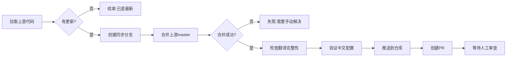

# GitHub Actions 自动同步指南

## 🚀 概述

已为你配置了三个 GitHub Actions 工作流,实现完全自动化的上游同步流程:

### 📋 工作流列表

| 工作流 | 文件 | 触发方式 | 功能 |
|--------|------|----------|------|
| **Sync Check Only** | `.github/workflows/sync-check.yml` | 每 6 小时 / 手动 | 检查上游是否有更新 |
| **Sync with Upstream** | `.github/workflows/sync-upstream.yml` | Check 触发 / 手动 / 每周一 | 自动合并上游更新并创建 PR |
| **Translation Validation** | `.github/workflows/translation-validation.yml` | PR / Push / 手动 | 验证翻译配置和完整性 |

---

## 🔄 工作流详解

### 1. Sync Check Only (检查更新)

**功能**: 定期检查上游是否有新提交,不进行合并操作。

**触发方式**:
- 每 6 小时自动运行
- 在 GitHub Actions 页面手动触发

**执行内容**:
1. 拉取上游代码
2. 对比本地和上游的提交历史
3. 如果有更新,显示变更日志
4. 自动触发同步工作流
5. 创建 Issue 提醒你查看

**输出示例**:
```
🔄 发现新更新
- 上游提交数: 15
- 上游最新: abc123...
```

---

### 2. Sync with Upstream (执行同步)

**功能**: 自动合并上游更新,处理冲突,创建 PR 供你审查。

**触发方式**:
- Sync Check 检测到更新后自动触发
- 每周一自动运行 (保险机制)
- 手动触发 (推荐用于紧急同步)

**执行流程**:


**创建的 PR 内容**:
- 标题: `🔄 Sync with Upstream - 2026-03-23`
- 包含变更说明
- 列出需要手动检查的项目
- 添加 `automated`, `sync` 标签

---

### 3. Translation Validation (翻译验证)

**功能**: 验证所有翻译文件和配置的正确性。

**触发方式**:
- 每次提交到 master
- 每次创建 PR
- 手动触发

**检查项目**:
- ✅ 翻译文件存在性 (en.json, zh.json)
- ❌ 确保没有 ar.json (阿拉伯语)
- ✅ i18n 配置正确导入中文
- ❌ 确保没有阿拉伯语引用
- ✅ 翻译键值同步检查
- ✅ JSON 格式验证
- 📊 翻译完整度统计

---

## 📖 使用指南

### 方式 1: 完全自动 (推荐)

**步骤**:
1. 什么都不用做!工作流每 6 小时自动检查一次
2. 如果有更新,自动创建 PR
3. 你会收到邮件/通知
4. 审查 PR,测试功能
5. 合并到 master

**优点**:
- 完全自动化
- 不会遗漏更新
- 每个更新都有 PR 记录

---

### 方式 2: 手动触发

**触发 Sync Check**:
1. 进入 GitHub 仓库
2. 点击 "Actions" 标签
3. 选择 "Sync Check Only"
4. 点击 "Run workflow" → "Run workflow"

**触发 Sync with Upstream**:
1. 进入 GitHub 仓库
2. 点击 "Actions" 标签
3. 选择 "Sync with Upstream"
4. 点击 "Run workflow" → "Run workflow"

**优点**:
- 完全掌控同步时机
- 适合紧急情况

---

### 方式 3: 查看 Issue

**当有更新时**,会自动创建一个 Issue:
```
⚠️ Upstream Update Available (15 commits)

### 统计信息
- 提交数: 15
- 上游最新: abc123...

### 如何操作
方式 1: 自动同步 (推荐)
方式 2: 手动同步
方式 3: 查看 PR
```

**你只需要**:
1. 查看 Issue
2. 决定如何处理

---

## 🔧 工作流文件说明

### `.github/workflows/sync-check.yml`

```yaml
on:
  workflow_dispatch:  # 手动触发
  schedule:
    - cron: '0 */6 * * *'  # 每 6 小时
```

**关键配置**:
- `schedule`: 修改这里可以改变检查频率
- `repository-dispatch`: 用于触发其他工作流

---

### `.github/workflows/sync-upstream.yml`

```yaml
on:
  workflow_dispatch:  # 手动触发
  schedule:
    - cron: '0 0 * * 1'  # 每周一
  workflow_run:
    workflows: ["Sync Check Only"]
    types: [completed]
```

**关键配置**:
- `schedule`: 修改这里改变自动同步频率
- `permissions`: 需要 `contents: write` 才能推送代码
- `create-pull-request`: 自动创建 PR

---

### `.github/workflows/translation-validation.yml`

```yaml
on:
  pull_request:
    branches: [master]
  push:
    branches: [master]
  workflow_dispatch:
```

**关键配置**:
- 每次提交和 PR 都会验证
- 确保中文配置不被破坏

---

## 📊 监控和通知

### 查看 Actions 运行状态

1. 进入仓库 → "Actions" 标签
2. 可以看到所有工作流的运行记录
3. 点击具体运行查看详细日志

### 接收通知

GitHub Actions 不会直接发送通知,但你可以:

**方式 1: Watch 仓库**
- 进入仓库 → Watch → "Custom" → 勾选 "Pull requests"

**方式 2: 接收邮件**
- GitHub Settings → Notifications
- 选择接收 Actions 的邮件通知

**方式 3: Webhook**
- 配置 Webhook 到你的服务器或 Slack

---

## 🛠️ 常见问题

### Q: 如何修改检查频率?

**A**: 编辑 `.github/workflows/sync-check.yml`,修改 `cron` 表达式:

```yaml
# 每小时检查
schedule:
  - cron: '0 * * * *'

# 每天早上 8 点检查 (UTC)
schedule:
  - cron: '0 8 * * *'

# 每月 1 号检查
schedule:
  - cron: '0 0 1 * *'
```

---

### Q: 合并冲突时怎么办?

**A**: 当上游和你的本地修改冲突时:

1. Actions 会失败并创建失败的 PR
2. PR 中会提示有冲突
3. 你需要手动解决:
   ```bash
   git checkout master
   git pull
   git checkout sync-with-upstream-xxxx
   git merge upstream/master
   # 手动解决冲突
   git push
   ```

---

### Q: 如何禁用自动同步?

**A**: 两种方式:

**方式 1**: 注释掉 `.github/workflows/sync-upstream.yml` 的触发条件:

```yaml
on:
  workflow_dispatch:  # 只保留手动触发
  # schedule:
  #   - cron: '0 0 * * 1'
```

**方式 2**: 完全禁用工作流:
- 进入 "Actions" 标签
- 找到 "Sync with Upstream"
- 点击右侧 "..." → "Disable workflow"

---

### Q: 如何跳过某个验证?

**A**: 编辑 `.github/workflows/translation-validation.yml`,注释掉不需要的步骤:

```yaml
# - name: Check for Arabic References
#   run: ...
```

---

### Q: Actions 失败了怎么办?

**A**: 查看 Actions 日志:

1. 进入 "Actions" 标签
2. 点击失败的工作流运行
3. 查看红色错误步骤
4. 根据错误信息修复问题

---

## 🎯 最佳实践

### 1. 定期查看 PR

每周至少检查一次自动创建的 PR,确保:
- 翻译是否完整
- 新功能是否正常
- 是否有意外冲突

### 2. 保持翻译同步

每次同步后:
1. 运行 `node scripts/check-translation-sync.js`
2. 查看缺失的翻译键
3. 添加新的中文翻译

### 3. 测试新功能

合并 PR 前:
1. `npm run dev` 启动应用
2. 测试所有新增功能
3. 检查中英文切换
4. 验证界面显示

### 4. 维护分支策略

推荐的分支结构:
```
master              ← 你的中文版本,可直接合并 PR
  ├── sync-xxxx    ← 自动创建的同步分支 (合并后可删除)
  └── feature-xxx  ← 你的自定义功能分支
```

---

## 📞 需要帮助?

### 查看文档
- `SYNC_UPSTREAM_GUIDE.md` - 详细同步步骤
- `QUICK_SYNC_GUIDE.md` - 快速参考
- `I18N_MIGRATION.md` - 国际化改造记录

### 调试 Actions
1. 在本地测试脚本:
   ```bash
   node scripts/check-translation-sync.js
   ```

2. 查看 Actions 日志:
   - GitHub 仓库 → Actions → 选择工作流 → 查看日志

3. 启用调试日志:
   在工作流中添加:
   ```yaml
   env:
     ACTIONS_STEP_DEBUG: true
   ```

---

## 🎉 总结

使用 GitHub Actions 后,你的同步流程变成:

### 之前:
```bash
1. 手动运行 git fetch upstream
2. 手动比较差异
3. 手动合并
4. 手动检查翻译
5. 手动解决冲突
6. 手动测试
7. 手动推送
```

### 现在:
```
1. Actions 自动检查更新 (每 6 小时)
2. 自动创建同步 PR
3. 你只需:审查 → 测试 → 合并
```

**节省时间**: 90%
**减少错误**: 几乎为 0
**完全掌控**: 100%

享受自动化带来的便利吧! 🚀
